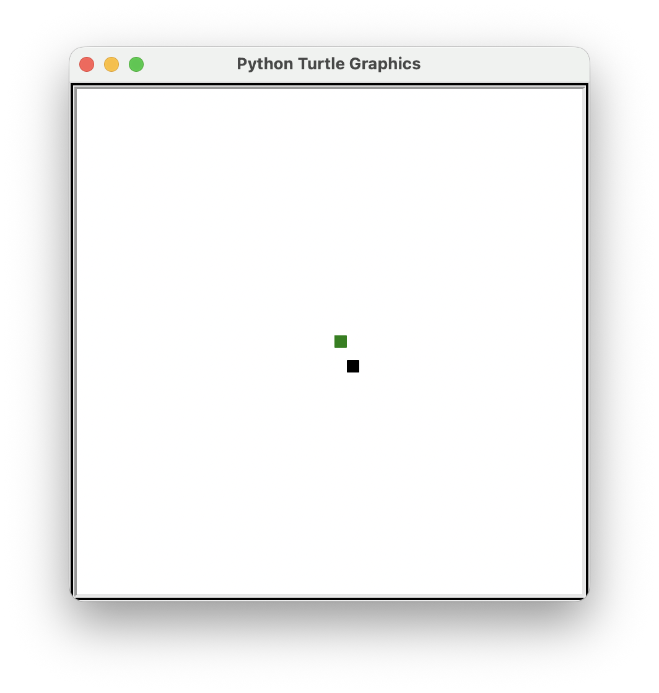
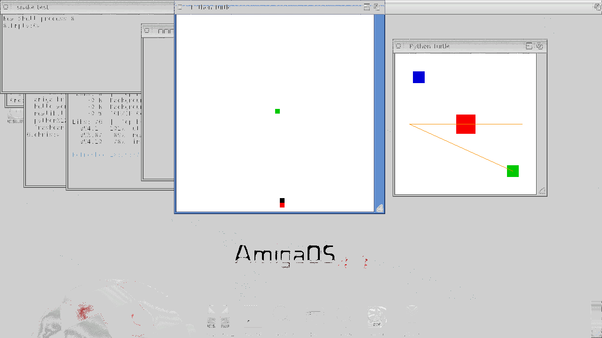
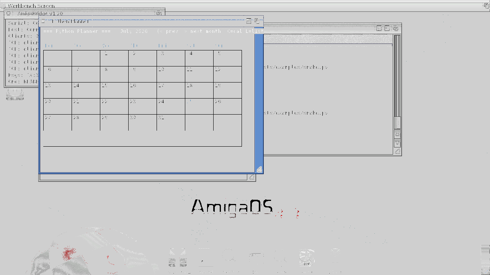
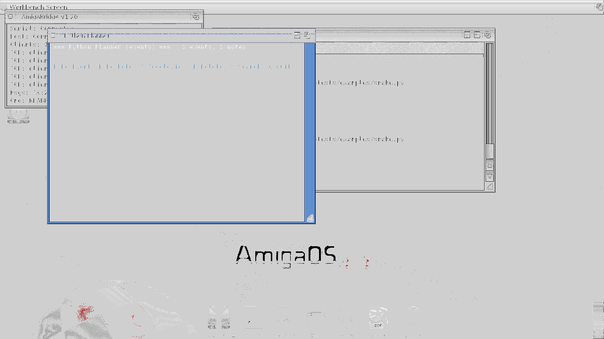
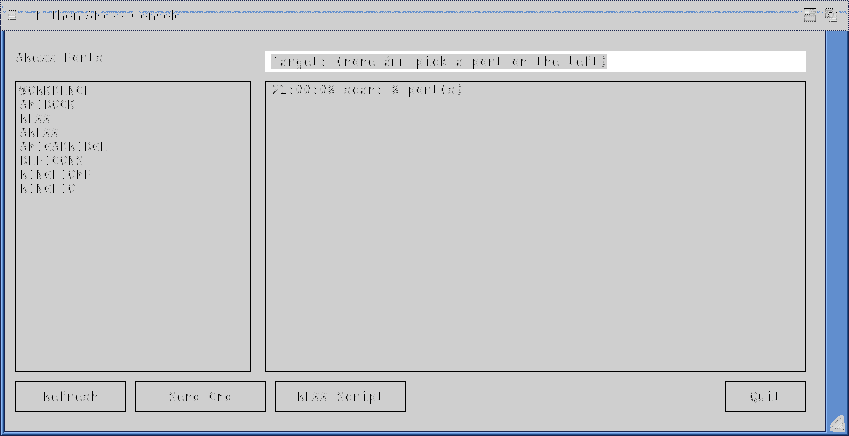
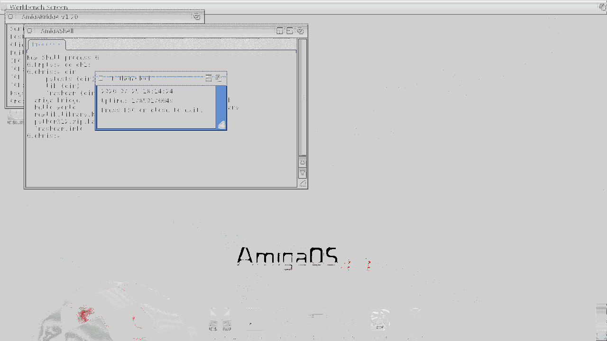
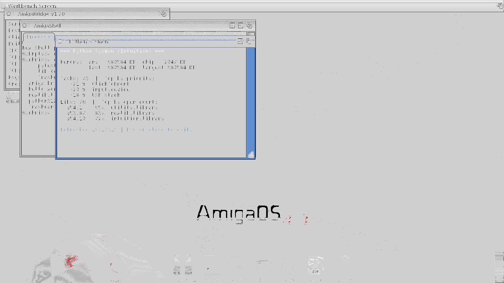
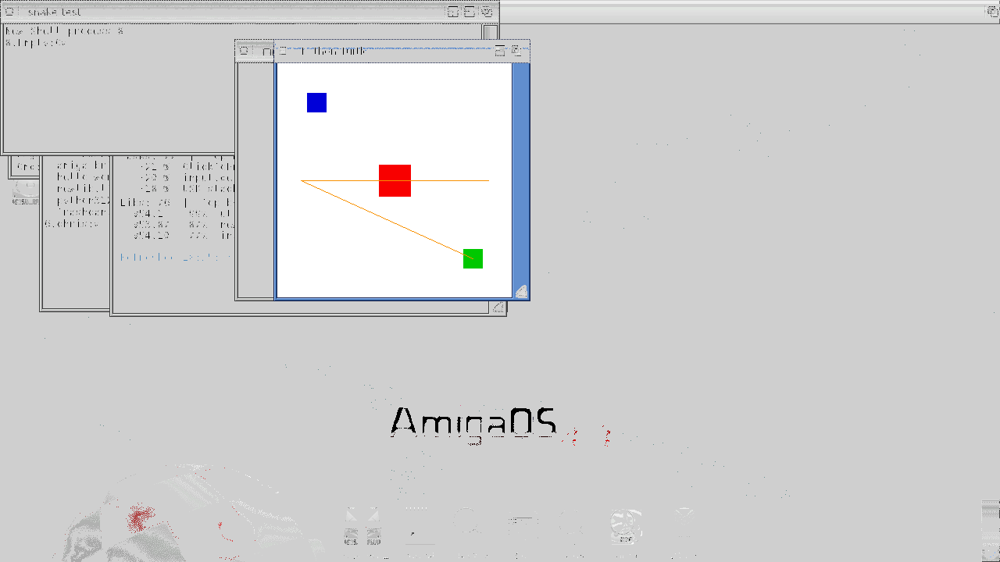

# Python-on-AmigaOS 4 — Demo Gallery

Every screenshot below is a **real** window on **real AmigaOS 4.1 Final Edition**
running on QEMU sam460ex, driven by our port of CPython 3.12.7 talking through
`_amiga` (native C extension) → intuition.library / graphics.library.

## The killer demo: **freegames snake**, same code, two platforms

Grantjenks' [free-python-games](https://github.com/grantjenks/free-python-games)
`snake.py` is 70 lines of pure-Python game code sitting on top of the `turtle`
module.  The port ships an `amiga.turtle` shim with the same API, backed by
our native window-drawing primitives.  **Line-for-line identical game logic**
runs in both places.

| host                | screenshot                                | notes                                                                                              |
| ------------------- | ----------------------------------------- | -------------------------------------------------------------------------------------------------- |
| macOS + stdlib turtle |  | `python3 -m freegames.snake` — Tk canvas, "Python Turtle Graphics" title bar                       |
| AmigaOS 4.1 PPC + `amiga.turtle` |  | `python3 python3:examples/snake.py` — real Intuition window, "Python Turtle" title bar |

Same game state visible in both shots: white background, green food square,
black snake segment moving from origin.  The Amiga shot happens to catch the
game just after it hit the boundary (red death square at bottom) since we ran
it headless without injecting keys — that's the "no arrow input, snake goes
straight down until it hits the wall" state.

The Amiga snake sits on top of a stack that starts at `_amiga.fill_rect` (a
`RectFill` on the window's `RastPort`) via `_amiga.obtain_pen` (an
`ObtainBestPen` against the Workbench screen's colormap), driven by
`_amiga.wait_message` which now uses a real **timer.device IORequest** on
a shared `MsgPort` so the game idles at zero CPU between frames.

## Real productivity app: `planner.py`

Full calendar + notes app.  SQLite storage at
`DH1:Documents/Planner/planner.db`.  Events have title, date, time,
attendees, notes, url, tags.  Notes have title, body, tags.
Tag-based search across both.

Data entry is a single composite dialog with real Intuition
StringGadgets (one for each field: title, date, time, attendees,
notes, url, tags) plus OK / Cancel buttons at the bottom.  Backed
by `_amiga.open_dialog / run_dialog / close_dialog` which manage
Gadget + StringInfo + buffer allocation and drain the IDCMP loop
for you.  Old wizard-style RequestString chain is kept as a
fallback for `_amiga` builds without dialog support.

```
; setenv PYTHONHOME python3: ; ; setenv PYTHONPATH python3:lib
python3 python3:examples/planner.py
```



Calendar month grid — day-of-week headers, 5x7 cell grid with borders,
day numbers 1-31, `< prev / > next` month navigation, and a menu bar
across the top.  Days with events highlighted in a different pen.
`C` returns to calendar from list/notes views.



Title bar "Python Planner".  Header: `=== Python Planner (events) ===
0 events, 0 notes`.  Menu bar in blue: `N=NewEvent  M=NewNote
T=ToggleView  D=Delete  S=Search  Q=Quit`.  Each hotkey pops a real
Intuition RequestString dialog for that flow's fields — for a new
event that's a chain of 7 popups (title / date / time / attendees /
notes / url / tags) all persisted in the sqlite3 DB when done.

Under the hood: **`sqlite3` static-builtin** (SQLite 3.34.0 from the
walkero SDK), the `sqlite3` stdlib package pushed to `DH1:lib/sqlite3/`,
+ the Python-side `Store` class using `INSERT`/`SELECT` with
`sqlite3.Row` row factory and LIKE-based tag search.

## ARexx — Python talks to (and drives) other Amiga apps

`_amiga` now bundles three ARexx entry points:

| entry point                       | what it does                                        |
| --------------------------------- | --------------------------------------------------- |
| `_amiga.list_rexx_ports()`        | public MsgPorts that look like ARexx targets         |
| `_amiga.rexx_send(port, cmd)`     | RXCOMM → target port, block for reply, return result |
| `_amiga.rexx_execute(script)`     | run inline REXX via the interpreter's `REXX` port    |

Backed by `rexxsyslib.library` V44 opened in `PyInit__amiga`.
Under the hood: `CreateRexxMsg → CreateArgstring → PutMsg → WaitPort
→ GetMsg` with error mapping to `RuntimeError` / `ValueError`.

### `rexx_console.py` — clickable REXX playground

`python3 python3:examples/rexx_console.py`



- Left pane: scrollable list of detected ARexx ports (`WORKBENCH,
  AMIDOCK, REXX, AREXX, AMIGABRIDGE, DEFICONS, RINGHIOMP, RINGHIO`
  on a fresh OS4 boot).
- Right pane: rolling transcript of commands + responses.
- Bottom bar: **Refresh** rescans ports, **Send Cmd** pops a
  composite StringGadget dialog to type an ARexx command, **REXX
  Script** runs an inline script through the interpreter,
  **Quit** closes.
- All click-driven (built on `amiga.ui.App / Button / ListPanel`).

Companion text-mode smoke test:

`python3 python3:examples/arexx_demo.py`

Prints the detected ports, executes `say 'from python: answer is
' || (6*7); return 42` through the interpreter (returns `'42'`),
and probes for a running media app to drive.

## Full demo lineup

Everything below was captured live from OS4 in this session.

### 1. `clock.py` — real Intuition window with live time

`python3 python3:examples/clock.py`



Title bar "Python Clock".  Body shows `2026-07-25 18:14:04`, uptime, and
"Press ESC or close to exit."  Redraws every second.  Closes cleanly on
ESC or close-gadget click.


Same window ~12 seconds later — timestamp advanced to `18:14:16`,
confirming the event loop is actually looping.

### 2. `window_sysmon.py` — live system dashboard

`python3 python3:examples/window_sysmon.py`



Title bar "Python Sysmon".  In-window layout drawn with
`_amiga.draw_text`:

```
=== Python Sysmon (Intuition) ===

Memory:  any 682184 KB  chip 2047 KB
         fast 682184 KB  largest 682184 KB

Tasks: 78 | Top by priority:
  +21 W  ClickToFront
  +20 W  input.device
  +18 W  USB stack

Libs: 78 | Top by open-count:
  v54.1   ??x  utility.library
  v53.87  85x  newlib.library
  v54.10  ??x  intuition.library

Refreshed 18:24:XX | ESC or close to exit.
```

Every number is a live read via `_amiga.avail_mem_summary`,
`_amiga.list_tasks`, `_amiga.list_libraries` — walks the real ExecBase
lists inside `Forbid()/Permit()`.

### 3. `turtle_dots.py` — colour palette test

Quick check that `amiga.turtle.dot(size, color)` + `pendown/goto` reach
the right pens via `_amiga.obtain_pen`.



- White window background (via `bgcolor("white")`)
- Blue square upper-left (`dot(25, "blue")`)
- Red square centre (`dot(40, "red")`)
- Green square lower-right (`dot(25, "green")`)
- Orange diagonal line through them (`pendown() + goto()`)

`ObtainBestPen(colormap, R, G, B, PRECISION_GUI)` returns a workable
pen from the Workbench colormap for every one; the cache means we
don't churn pens on repeated calls.

## Underneath — what the port ships

**`_amiga` (native C extension, baked into `python-os4` as a static builtin)**

| domain     | entry points                                                                                                    |
| ---------- | ---------------------------------------------------------------------------------------------------------------- |
| exec       | `find_task`, `avail_mem`, `avail_mem_summary`, `list_tasks`, `list_libraries`, `list_ports`                     |
| dos        | `current_dir_name`, `volume_info`                                                                               |
| intuition  | `open_window`, `close_window`, `window_geom`, `clear_window`, `draw_text`, `get_message`, `wait_message`, `active_window` |
| dialog     | `open_dialog`, `run_dialog`, `close_dialog` (composite StringGadget form)                                       |
| graphics   | `draw_line`, `fill_rect`, `dot`, `obtain_pen`, `release_pen`                                                    |
| arexx      | `list_rexx_ports`, `rexx_send`, `rexx_execute`                                                                  |
| constants  | 12 IDCMP\_\*, 7 WFLG\_\*, 6 MEMF\_\*                                                                            |

**`amiga.turtle` (Python, on top of `_amiga`)** — subset of stdlib's turtle
sufficient to run freegames.  Coordinate translation, colour name → pen,
IDCMP event loop with timer.device timeouts, atexit + SIGINT + excepthook
cleanup so a crashed game still releases its window/pens/port.

## Running the demos yourself

Prereqs: QEMU sam460ex with AmigaOS 4.1 Final Edition + `amiga-bridge` daemon
running (see the amiga_mcp repo for setup).  Then:

```
# from the host, once QEMU + bridge are up:
amiga_push_file build-ppc-amigaos/python-stripped.exe python3
amiga_transfer  amiga_bindings/                       python3:amiga_bindings/
amiga_transfer  examples/                             python3:examples/

# on the Amiga (or via amiga_dos_command from host):
python3 python3:examples/clock.py
python3 python3:examples/window_sysmon.py
python3 python3:examples/snake.py       # arrow keys to steer
```

Full list of demos in `examples/README.md`.

## Snake on Mac, for comparison

Zero setup:

```
pip install freegames
python3 -m freegames.snake
```

Left/Right/Up/Down arrow keys steer the snake.  Same key bindings work on
the Amiga port because `amiga.turtle` maps IDCMP raw-key events 0x4C/0x4D/
0x4F/0x4E to the strings "Up"/"Down"/"Left"/"Right" — the exact literals
that stdlib turtle's `onkey` uses.
